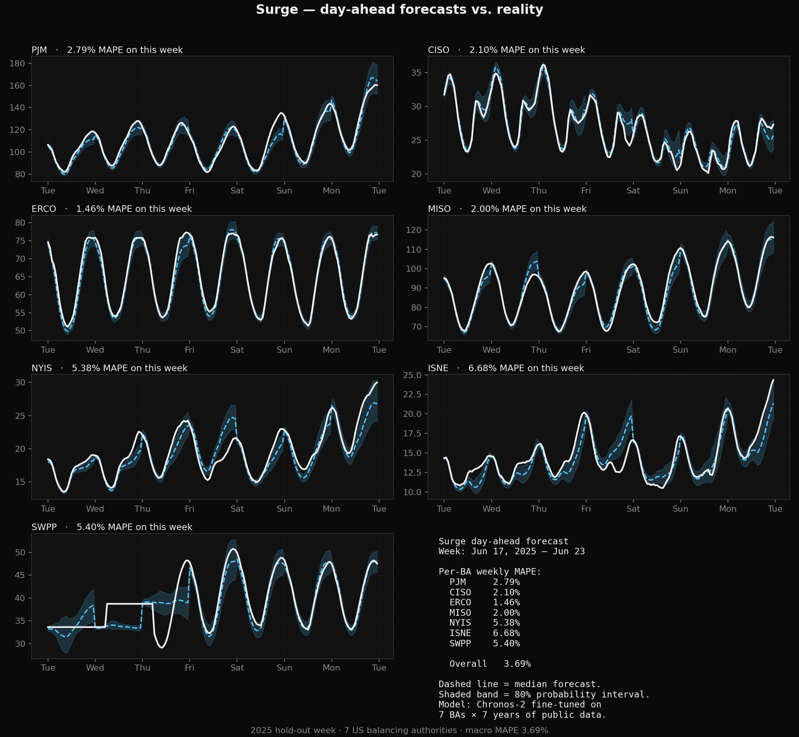
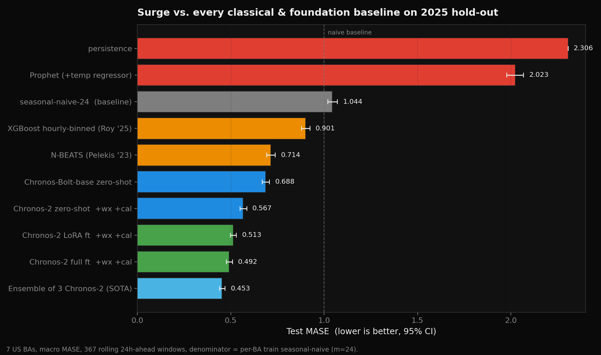
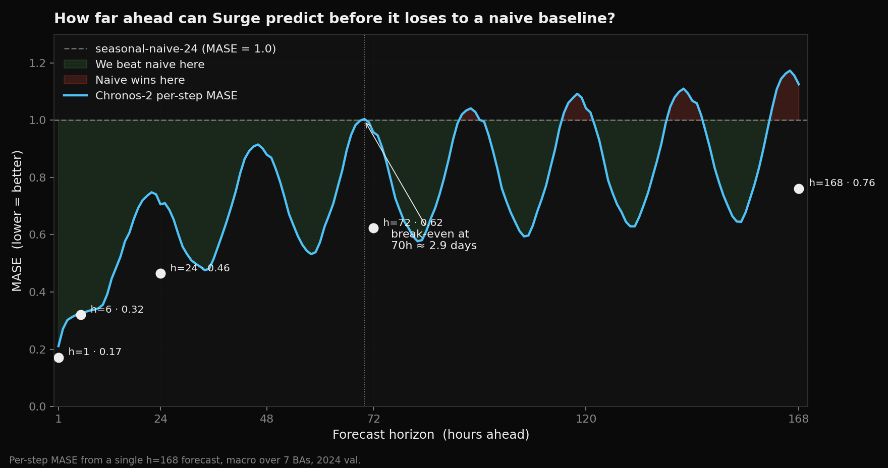

# surge

**Open, probabilistic day-ahead load forecasts for the US power grid.**

A fine-tuned Chronos-2 foundation model + FastAPI service + hosted
playground covering every US balancing authority that publishes a demand
series to EIA-930 — 53 BAs spanning the Eastern, Western, and Texas
interconnections. Public data only, one-command deploy, permissive license.

- **Live demo** — [surgeforecast.com](https://surgeforecast.com)
- **Code** — [github.com/tylergibbs1/surge](https://github.com/tylergibbs1/surge)
- **Model** — [huggingface.co/Tylerbry1/surge-fm-v3](https://huggingface.co/Tylerbry1/surge-fm-v3)



*Chronos-2 fine-tuned on 7 years of EIA-930 load + ASOS temperature + calendar
features. Dashed line = median forecast, shaded band = 80% probability
interval, solid = actual.*

## What it is

- `surge` — Python library for pulling and harmonising US grid data
  (EIA-930 load, ASOS temperature, wind/solar generation, CAISO OASIS,
  ERCOT public reports, NOAA storm events). Central BA registry in
  `surge.bas` tracks all 67 EIA-930 balancing authorities (53 with a
  demand series, 14 gen-/transmission-only).
- `surge-fm-v3` — Chronos-2 fine-tuned on 7 years × 53 BAs of load with
  temperature + calendar covariates. **Test MASE 0.636** on 2025 hold-out
  (macro over 53 BAs); **0.518** on the original 7 RTOs (PJM/CAISO/ERCOT/
  MISO/NYISO/ISO-NE/SPP). Beats seasonal-naive-24 by 36% overall, 48% on
  the RTO subset.
- `surge-fm-v2` — Previous generation, 7-BA RTO-only model. **Test MASE
  0.49** on 2025 hold-out. Still available via `SURGE_MODEL_PATH` for
  users who want the narrower-but-sharper 7-BA variant.
- `surge.api` — FastAPI inference service with NDJSON streaming and OpenAPI docs.
- `web/playground` — Next.js playground at **surgeforecast.com**. Four
  coordinated views over the same data:
    * **Map** — MapLibre US choropleth, colour-coded by interconnect,
      pins sized by current load. Click any BA to drill into its chart.
    * **Grid** (`/grid`) — 53 BA cards sortable by % of all-time peak,
      peak GW, or name. Filters for interconnection (Eastern/Western/
      Texas) and size tier (RTO / major utility / small). Each card
      shows a 24 h sparkline and a traffic-light status dot.
    * **Live hero** — [Liveline](https://github.com/benjitaylor/liveline)
      canvas chart of rolling 24 h US aggregate demand (~165 GW
      overnight, ~240 GW on a summer afternoon), polling
      `/api/live-load` every 60 s with a visibility-gated interval and
      keep-last-good fallback on transient 502s.
    * **Now indicator** on each BA's forecast chart — a dashed vertical
      line + pulsing SVG dot at the current hour, sliding rightward
      through the 24 h window once a minute.
- Daily "bake" — `/api/bake` regenerates the full forecast set at
  06:15 UTC and writes `forecasts/{BA}.json` + `forecasts/all.json`
  to Vercel Blob. The read-side tries the blob first (~300 ms edge-
  cached) and falls through to live Modal inference on miss or
  `?force=1` (~3 s cold).

## Quick start

### Library

```python
import surge

# 24h of PJM hourly load, written to a local parquet store
df = surge.load(ba="PJM", start="2025-06-01", end="2025-06-02")
print(df.head())
```

### API

```bash
pip install -e ".[api]"
python -m surge.ingest --days 90    # populate data store (all 53 BAs by default)
# checkpoint auto-downloads from https://huggingface.co/Tylerbry1/surge-fm-v3
uvicorn surge.api.main:app --port 8000

# 24-hour probabilistic forecast for PJM
curl 'http://localhost:8000/forecast/PJM?horizon=24'

# Streaming NDJSON for every supported BA
curl -N 'http://localhost:8000/forecast/stream?horizon=24'

# Full BA registry (codes, names, stations, peak MW)
curl 'http://localhost:8000/bas'
```

Response:

```json
{
  "ba": "PJM",
  "model": "surge-fm-v3",
  "as_of_utc": "2026-04-18T20:54:13Z",
  "horizon": 24,
  "units": "MW",
  "points": [
    {"ts_utc": "2026-04-19T00:00:00Z", "median_mw": 112454, "p10_mw": 111570, "p90_mw": 113493},
    ...
  ]
}
```

## Accuracy vs. the status quo



### 7-RTO subset (same benchmark as v1/v2)

| Model | Test MASE | vs. seasonal-naive-24 | Cost |
|---|---:|---:|---|
| seasonal-naive-24 (baseline) | 1.044 | — | — |
| Prophet (with temp regressor) | 2.023 | +94% worse | — |
| XGBoost hourly-binned (Roy '25) | 0.901 | −14% | — |
| N-BEATS (Pelekis '23) | 0.714 | −32% | — |
| Chronos-Bolt zero-shot | 0.688 | −34% | — |
| Chronos-2 zero-shot + covariates | 0.567 | −46% | — |
| **surge-fm-v2 (7-BA specialist)** | **0.492** | **−53%** | free |
| **surge-fm-v3 (53-BA generalist) — RTO subset** | **0.518** | **−50%** | free |

### All 53 BAs (v3 only — v2 doesn't cover most of these)

| Slice | Test MASE | n BAs | MAE (MW macro) |
|---|---:|---:|---:|
| All demand-reporting BAs | 0.636 | 53 | 272 |
| 7 RTO/ISOs | 0.518 | 7 | 889 |
| 46 non-RTO utilities | 0.653 | 46 | 178 |

All numbers: 2025 hold-out, rolling 24h-ahead windows at step=24, MASE
denominator = per-BA train-set seasonal-naive (m=24). Weather covariates
are ground-truth ASOS temperature where available (7 RTO BAs ingested from
day one; the 46 non-RTO BAs use a zero-filled fallback pending a backfill
from the new weather-station mapping in `surge.bas`).

### vs. the grid operators' own forecasts

**Surge beats EIA's day-ahead demand forecast on 6 of 7 major RTOs.**

Every RTO/ISO submits a day-ahead load forecast to EIA each morning — that's
the *production* forecast used to schedule generation. We pull the operator
submissions (`type=DF` on EIA's Grid Monitor endpoint) and score them against
actuals for the exact same 2025 window, same 24h horizon, same per-BA MASE
denominator surge uses — 8,760 hours per BA, ~61,000 hours total.

| Region | Surge MAE | Operator MAE | Ratio | Surge MASE | Operator MASE |
|---|---:|---:|---:|---:|---:|
| PJM | 1,937 MW | 3,297 MW | 1.70× | 0.40 | 0.68 |
| CAISO | 652 MW | 2,098 MW | **3.22×** | 0.51 | 1.66 |
| ERCOT | 1,215 MW | 1,366 MW | 1.12× | 0.50 | 0.56 |
| MISO | 1,450 MW | 1,786 MW | 1.23× | 0.45 | 0.55 |
| NYISO | 501 MW | 560 MW | 1.12× | 0.53 | 0.60 |
| **ISO-NE** | **577 MW** | **306 MW** | **0.53×** | **0.63** | **0.34** |
| SPP | 896 MW | 2,590 MW | **2.89×** | 0.61 | 1.77 |
| **macro (7 RTOs)** | **1,032 MW** | **1,715 MW** | **1.66×** | **0.52** | **0.88** |

Surge's macro MAE is ~40% lower than the operators' own submissions; macro
MASE is ~41% lower. **ISO-NE is the sole loss** — their forecasting team is
elite (MASE 0.34 is genuinely excellent for a 24-hour-ahead forecast). Two
operator submissions, **CAISO (MASE 1.66) and SPP (MASE 1.77)**, did worse
than a "same as yesterday" baseline on the 2025 window — a polite way of
saying their day-ahead pipelines need work.

Reproduce: `python scripts/compare_eia_df.py --start 2025-01-01 --end 2026-01-01`.

## How far ahead can it forecast?



Chronos-2 beats seasonal-naive-24 out to **~70 hours (≈ 2.9 days)** ahead.
Beyond that, weekly patterns win. Useful-horizon ceiling without adding
weather forecasts is therefore roughly 3 days; extending it further requires
HRRR/GFS weather as future covariates.

## Status

Pre-release, hosted demo live. The API runs locally from a one-line
`uvicorn`, the 53-BA checkpoint auto-downloads from Hugging Face on
first request, and the playground at [surgeforecast.com](https://surgeforecast.com)
is open to anyone. See [roadmap](#roadmap) for what's next.

## License

MIT — see [LICENSE](LICENSE).

## Disclaimer

Research and reference use only. **Not for trading, regulated bidding, or
bankability-graded decisions.** No SLA. Accuracy numbers are measured on a
specific 2025 hold-out and may not generalise to future extreme events.

## Roadmap

- [x] Phase 0: scaffold, data library (7 BAs load + weather), parquet store
- [x] Phase 1: Chronos-2 fine-tune, benchmark vs classical + FM baselines
- [x] Phase 1: FastAPI inference service
- [x] Phase 2: all EIA-930 BAs (53 demand-reporting, 67 total registered),
      surge-fm-v3 checkpoint, BA registry in `surge.bas`, dynamic `/bas`
      metadata endpoint, playground map extended to every BA footprint
- [x] Phase 2: always-on hosted demo at [surgeforecast.com](https://surgeforecast.com)
      with map + grid + live US-demand hero + now-indicator, daily bake
      to Vercel Blob, Modal fallback for on-demand inference
- [ ] Phase 2: ASOS backfill for the 46 new BAs (Iowa Mesonet rate-limit
      cleanup — currently zero-filled) and retrain as surge-fm-v4
- [ ] Phase 2: LMP forecasting task, Hugging Face dataset release
- [ ] Phase 3: scenario simulator (surge-sim)
