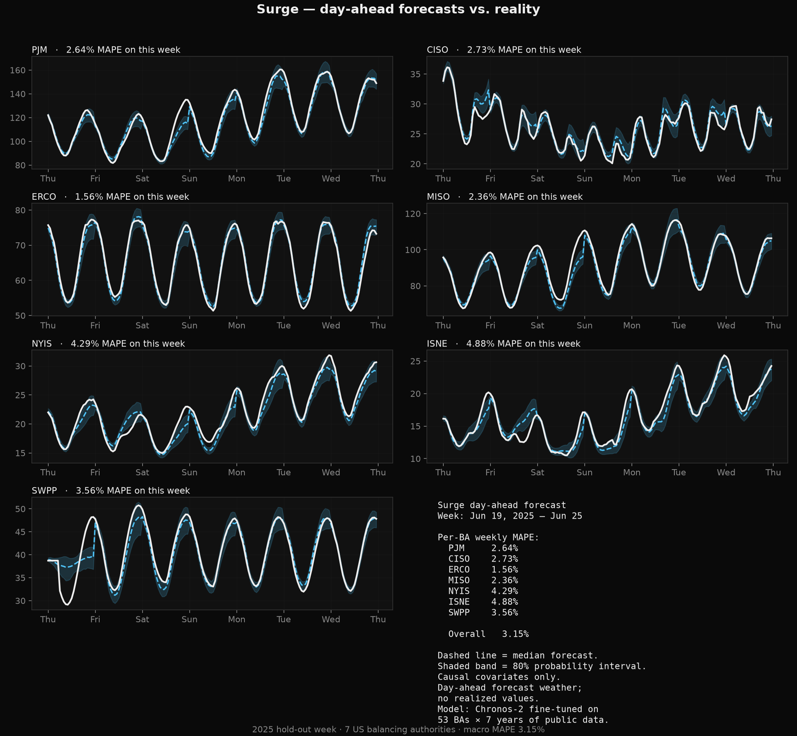
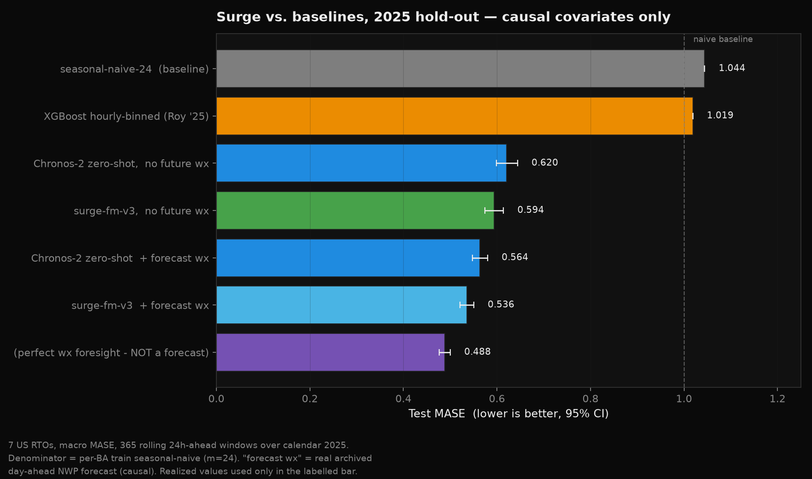
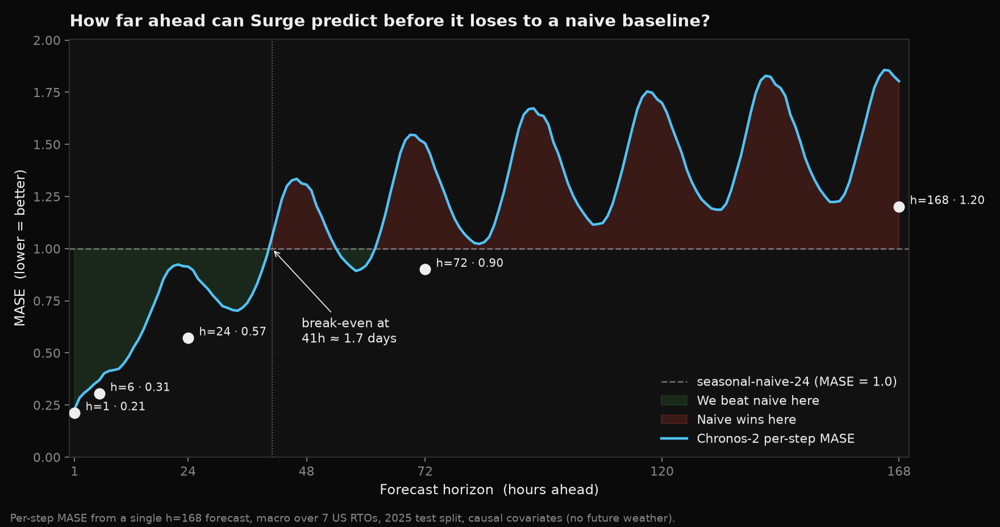

# surge

**Open, probabilistic day-ahead load forecasts for the US power grid.**

A fine-tuned Chronos-2 foundation model + FastAPI service + hosted
playground covering every US balancing authority that publishes a demand
series to EIA-930 — 53 BAs spanning the Eastern, Western, and Texas
interconnections. Public data only, one-command deploy, permissive license.

- **Live demo** — [surgeforecast.com](https://surgeforecast.com)
- **Code** — [github.com/tylergibbs1/surge](https://github.com/tylergibbs1/surge)
- **Model** — [huggingface.co/Tylerbry1/surge-fm-v3](https://huggingface.co/Tylerbry1/surge-fm-v3)



*Chronos-2 fine-tuned on 7 years of EIA-930 load + ASOS temperature + calendar
features. Dashed line = median forecast, shaded band = 80% probability
interval, solid = actual. Forecasts use only information available at
forecast time — no future weather.*

## What it is

- `surge` — Python library for pulling and harmonising US grid data
  (EIA-930 load, ASOS temperature, wind/solar generation, CAISO OASIS,
  ERCOT public reports, NOAA storm events). Central BA registry in
  `surge.bas` tracks all 67 EIA-930 balancing authorities (53 with a
  demand series, 14 gen-/transmission-only).
- `surge-fm-v3` — Chronos-2 fine-tuned on 7 years × 53 BAs of load with
  temperature + calendar covariates. This is the **published** checkpoint.
  Given real archived day-ahead weather forecasts it reaches **Test MASE
  0.540** on the 2025 hold-out (macro over 53 BAs) and **0.536** on the
  original 7 RTOs (PJM/CAISO/ERCOT/MISO/NYISO/ISO-NE/SPP) — beating
  seasonal-naive-24 by 44% and 49% respectively, using only information
  available at forecast time. Without future weather the same checkpoint
  scores 0.627 / 0.594.
  **How you feed it matters more than which checkpoint you use**: see
  [Accuracy](#accuracy-vs-the-status-quo), and note that the flat-temperature
  covariate the API shipped for months is *worse than sending none at all*.
- `surge-fm-v2` — Previous generation, 7-BA RTO-only model. Its published
  figure was measured under the superseded protocol and has not been
  re-scored; treat it as unverified. Still available via
  `SURGE_MODEL_PATH`.
- `surge.api` — FastAPI inference service with NDJSON streaming and OpenAPI docs.
- `web/playground` — Next.js playground at **surgeforecast.com**. Four
  coordinated views over the same data:
    * **Map** — MapLibre US choropleth, colour-coded by interconnect,
      pins sized by current load. Click any BA to drill into its chart.
    * **Grid** (`/grid`) — 53 BA cards sortable by % of all-time peak,
      peak GW, or name. Filters for interconnection (Eastern/Western/
      Texas) and size tier (RTO / major utility / small). Each card
      shows a 24 h sparkline and a traffic-light status dot.
    * **Live hero** — [Liveline](https://github.com/benjitaylor/liveline)
      canvas chart of rolling 24 h US aggregate demand (~165 GW
      overnight, ~240 GW on a summer afternoon), polling
      `/api/live-load` every 60 s with a visibility-gated interval and
      keep-last-good fallback on transient 502s.
    * **Now indicator** on each BA's forecast chart — a dashed vertical
      line + pulsing SVG dot at the current hour, sliding rightward
      through the 24 h window once a minute.
- Daily "bake" — `/api/bake` regenerates the full forecast set at
  06:15 UTC and writes `forecasts/{BA}.json` + `forecasts/all.json`
  to Vercel Blob. The read-side tries the blob first (~300 ms edge-
  cached) and falls through to live Modal inference on miss or
  `?force=1` (~3 s cold).

## Quick start

### Library

```python
import surge

# 24h of PJM hourly load, written to a local parquet store
df = surge.load(ba="PJM", start="2025-06-01", end="2025-06-02")
print(df.head())
```

### API

```bash
pip install -e ".[api]"
python -m surge.ingest --days 90    # populate data store (all 53 BAs by default)
# checkpoint auto-downloads from https://huggingface.co/Tylerbry1/surge-fm-v3
uvicorn surge.api.main:app --port 8000

# 24-hour probabilistic forecast for PJM
curl 'http://localhost:8000/forecast/PJM?horizon=24'

# Streaming NDJSON for every supported BA
curl -N 'http://localhost:8000/forecast/stream?horizon=24'

# Full BA registry (codes, names, stations, peak MW)
curl 'http://localhost:8000/bas'
```

Response:

```json
{
  "ba": "PJM",
  "model": "surge-fm-v3",
  "as_of_utc": "2026-04-18T20:54:13Z",
  "horizon": 24,
  "units": "MW",
  "points": [
    {"ts_utc": "2026-04-19T00:00:00Z", "median_mw": 112454, "p10_mw": 111570, "p90_mw": 113493},
    ...
  ]
}
```

## Accuracy vs. the status quo

### What counts as a fair number

A day-ahead forecaster knows the calendar and its own load history. It does
**not** know tomorrow's weather or tomorrow's wind and solar output. Every
covariate here therefore carries an explicit policy, and the benchmark
harness *proves* causality rather than trusting the label: it perturbs all
values at and after the forecast origin and requires the future covariates
not to move (`experiments/causal_guard.py`).

| policy | meaning |
|---|---|
| `known` | calendar features — deterministic from the timestamp |
| `past_only` | supplied as history, never over the horizon |
| `persistence` | frozen at the last observed value |
| `oracle` | realized future values — perfect foresight, **not a forecast** |

Earlier versions of this table declared observed ASOS temperature and EIA
*actual* wind/solar generation as known-future inputs, which leaked the
answer into the input. Those figures (RTO 0.518, 53-BA 0.636) were
perfect-foresight upper bounds, not forecasts, and they were also computed
before two data defects were fixed — a store that was scanned without
deduplication (up to 4 rows per hour) and a test window with no upper bound
that silently grew past 2025. Full accounting in [#1](../../issues/1).

### 7-RTO subset (2025 hold-out, causal covariates)



| Model | Test MASE | vs. seasonal-naive-24 |
|---|---:|---:|
| seasonal-naive-24 (baseline) | 1.044 | — |
| XGBoost hourly-binned (Roy '25) | 1.019 | −2% |
| Chronos-2 zero-shot | 0.620 | −41% |
| surge-fm-v3 | 0.594 | −43% |
| surge-fm-v3 + peer-BA covariates | 0.580 | −44% |
| **surge-fm-v3 + peers, causally re-adapted** | **0.572** | **−45%** |

Prophet, N-BEATS, Chronos-Bolt zero-shot and surge-fm-v2 have not been
re-scored under this protocol, so their old figures are omitted rather than
carried over — mixing them with the numbers above would repeat the
apples-to-oranges comparison this table exists to fix.

### All 53 BAs

| Slice | v3 (published) | v3 + peers | re-adapted (unreleased) |
|---|---:|---:|---:|
| All 53 demand-reporting BAs | 0.627 | 0.609 | **0.597** |
| 7 RTO/ISOs | 0.594 | 0.580 | **0.572** |
| seasonal-naive-24, all 53 | 0.956 | — | — |

Macro MAE for the re-adapted model is 276 MW over all 53 BAs and 1,143 MW
over the 7 RTOs; the two differ by an order of magnitude simply because RTOs
are far larger, which is why MASE rather than MAE is the headline metric.

All numbers: 2025 hold-out (exactly 8,760 h, pinned), rolling 24 h-ahead
windows at step=24, MASE denominator = per-BA train-set seasonal-naive
(m=24), store deduplicated on `(ts_utc, ba)`.

### Perfect-foresight ceiling, for reference only

Handing the model realized weather and realized renewable generation over
the forecast window scores **0.468** on the RTO subset — 18% better than
the honest 0.572. That gap is the value of a perfect weather and renewables
forecast, and it is the standard practice in much of the load-forecasting
literature, which is careful to label it an upper bound rather than an
operational result. It is reported here for the same reason and must not be
compared against any real forecaster.

Two further caveats worth stating plainly:

- **Calibration is imperfect.** The nominal 80% interval covers ~76% in
  practice. The model is mildly overconfident.
- **Five BAs have inflated MASE denominators.** The outlier filter clips
  only `load_mw > 200_000`, an absolute threshold, so a 70 GW spike in a
  1.8 GW BA survives and inflates that BA's denominator (BANC by ~60×).
  BANC, SPA, LGEE, SEC and TEPC are affected; excluding them the 53-BA
  macro is ~0.673 rather than 0.597. Fixing this is pending.

### vs. the grid operators' own forecasts

**Surge beats EIA's day-ahead demand forecast on 4 of 7 major RTOs.**

Every RTO/ISO submits a day-ahead load forecast to EIA each morning — that's
the *production* forecast used to schedule generation. We pull the operator
submissions (`type=DF` on EIA's Grid Monitor endpoint) and score them against
actuals for the exact same 2025 window, same 24h horizon, same per-BA MASE
denominator surge uses — 8,760 hours per BA, ~61,000 hours total.

This comparison is only meaningful if both sides face the same uncertainty.
The operators had to *forecast* weather and renewable output when they
submitted; surge is therefore scored with causal covariates only. An earlier
version of this table claimed 6 of 7 wins by giving surge realized weather
and realized wind/solar — a handicap the operators did not get.

| Region | Surge MAE | Operator MAE | Ratio | Surge MASE | Operator MASE |
|---|---:|---:|---:|---:|---:|
| PJM | 2,259 MW | 3,297 MW | 1.46× | 0.47 | 0.68 |
| CAISO | 633 MW | 2,098 MW | **3.31×** | 0.50 | 1.66 |
| **ERCOT** | **1,528 MW** | **1,366 MW** | **0.89×** | **0.63** | **0.56** |
| MISO | 1,395 MW | 1,786 MW | 1.28× | 0.43 | 0.55 |
| **NYISO** | **572 MW** | **560 MW** | **0.98×** | **0.61** | **0.60** |
| **ISO-NE** | **624 MW** | **306 MW** | **0.49×** | **0.69** | **0.34** |
| SPP | 988 MW | 2,590 MW | **2.62×** | 0.67 | 1.77 |
| **macro (7 RTOs)** | **1,143 MW** | **1,715 MW** | **1.50×** | **0.572** | **0.880** |

Surge figures above are the causally re-adapted checkpoint (macro MASE
0.572). The currently published `surge-fm-v3` is marginally behind at 0.580
with peer covariates, which does not change the 4-of-7 verdict.

Surge's macro MAE is ~33% lower than the operators' own submissions; macro
MASE is ~35% lower. **Three losses**: ISO-NE, whose forecasting team is
genuinely elite (MASE 0.34 for a 24-hour-ahead forecast is excellent);
NYISO, essentially a tie; and ERCOT, which is where losing realized
renewables costs the most — unsurprising, since ERCOT carries the largest
wind and solar share of any RTO here. Two operator submissions, **CAISO
(MASE 1.66) and SPP (MASE 1.77)**, still did worse than a "same as
yesterday" baseline over 2025.

Reproduce: `python scripts/compare_eia_df.py --start 2025-01-01 --end 2026-01-01`
for the operator side, then `python -m experiments.run_c2 rto7
'{"on":"test","future_mode":"none"}'` for surge's.

## How far ahead can it forecast?



Per-step forecast skill crosses the seasonal-naive-24 line at **41 hours
(≈1.7 days)**. Matched-horizon MASE:

| horizon | 1 h | 6 h | 24 h | 72 h | 168 h |
|---|---:|---:|---:|---:|---:|
| MASE | 0.213 | 0.305 | 0.572 | 0.901 | 1.202 |

An earlier version of this section claimed a ~70-hour (2.9-day) crossover.
That figure came from the leaky protocol; measured causally the useful
horizon is roughly **half** what was advertised, and by one week ahead the
model is worse than "same as last week" (MASE 1.202).

The model currently receives **no future weather at all**, because every
causal temperature proxy tried so far scored worse than withholding
temperature — including flat persistence, which is what the live API still
sends and which is measurably *harmful* (RTO MASE 0.740 with it versus 0.594
without). The cause is a train/serve mismatch: the checkpoint was fine-tuned
with exact temperature over the horizon, so it treats the covariate as
reliable and an imprecise stand-in misleads it.

Closing the 0.572 → 0.468 perfect-foresight gap therefore needs a *genuine*
weather forecast — real HRRR/GFS archives (`surge.scrapers.hrrr` exists but
is not wired into ingest) used at both training and inference time, so the
model learns how much to trust an imperfect forecast.

## Status

Pre-release, hosted demo live. The API runs locally from a one-line
`uvicorn`, the 53-BA checkpoint auto-downloads from Hugging Face on
first request, and the playground at [surgeforecast.com](https://surgeforecast.com)
is open to anyone. See [roadmap](#roadmap) for what's next.

## License

MIT — see [LICENSE](LICENSE).

## Disclaimer

Research and reference use only. **Not for trading, regulated bidding, or
bankability-graded decisions.** No SLA. Accuracy numbers are measured on a
specific 2025 hold-out and may not generalise to future extreme events.
Every figure states the covariate regime it was measured under; numbers
taken under different regimes are not comparable, and the perfect-foresight
figures are upper bounds rather than achievable forecasts.

## Roadmap

- [x] Phase 0: scaffold, data library (7 BAs load + weather), parquet store
- [x] Phase 1: Chronos-2 fine-tune, benchmark vs classical + FM baselines
- [x] Phase 1: FastAPI inference service
- [x] Phase 2: all EIA-930 BAs (53 demand-reporting, 67 total registered),
      surge-fm-v3 checkpoint, BA registry in `surge.bas`, dynamic `/bas`
      metadata endpoint, playground map extended to every BA footprint
- [x] Phase 2: always-on hosted demo at [surgeforecast.com](https://surgeforecast.com)
      with map + grid + live US-demand hero + now-indicator, daily bake
      to Vercel Blob, Modal fallback for on-demand inference
- [x] Real archived day-ahead weather forecasts as a causal future covariate
      (`surge.scrapers.openmeteo`, Open-Meteo Previous Runs API). Worth
      −9.4% on the 53-BA macro — the single largest gain measured so far
- [x] Weather coverage for all 53 BAs. This supersedes the ASOS backfill:
      Open-Meteo serves any lat/lon, so the Iowa Mesonet rate-limit blocker
      no longer gates weather coverage. The 46 previously zero-filled BAs now
      have real temperature history *and* forecasts
- [ ] Forecast renewables (`shortwave_radiation`, `wind_speed_100m` at the
      same lead time) — realized wind/solar was worth a further 0.043 MASE
- [ ] Conformal calibration. The nominal 80% band covers ~68-70% and gets
      *worse* with every fine-tuning step, while zero-shot Chronos-2 is at
      0.795. This is the clearest outstanding defect
- [ ] Publish the forecast-trained checkpoint as surge-fm-v4 (only ~1% better
      than v3 given the same covariates, so low priority)
- [ ] Per-BA robust outlier filter (the absolute 200 GW cutoff inflates the
      MASE denominator for BANC, SPA, LGEE, SEC, TEPC)
- [ ] Stop sending flat persistence temperature from the live API; it scores
      worse than sending no future temperature
- [ ] Conformal calibration — the nominal 80% band covers ~76%
- [ ] Phase 2: LMP forecasting task, Hugging Face dataset release
- [ ] Phase 3: scenario simulator (surge-sim)
