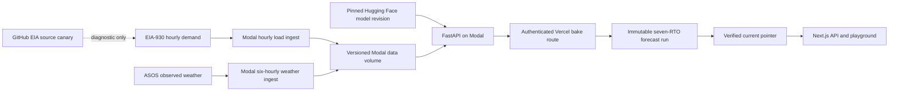

# Operations and restore runbook

This runbook covers the v0.2 service topology, freshness contract, recovery,
and rollback. It records secret names but never their values.

## Architecture and sources of truth



| State | Authority | Recovery material |
|---|---|---|
| Code | signed Git tag / GitHub commit | release source and wheel |
| Model | Hugging Face repository plus immutable SHA | checksummed local export |
| Operational load and observed weather | Modal volume | versioned data snapshot and manifest |
| Forecasts | immutable Vercel Blob run | run manifest and `current` pointer |
| Credentials | provider secret stores | names/owners in the access inventory |

The GitHub `ingest.yml` job is a source canary. Its temporary data is not read
by production and is not a backup.

## Freshness and health

Freshness is measured from source timestamps, never request or bake time.

| Component | Warning | Critical behavior |
|---|---:|---|
| Aggregate EIA load watermark | older than 6 hours: API health degrades | older than 12 hours: aggregate readiness fails |
| Aggregate ASOS weather watermark | older than 6 hours: API health degrades | older than 12 hours: aggregate readiness fails |
| Per-RTO load or weather watermark | probe each RTO; not represented separately in health | older than 12 hours: that RTO's issuance fails |
| Complete baked run | older than 26 hours: mark delayed | older than 36 hours: bulk read rejects it; use a healthy live fallback or return unavailable |
| Forecast payload | context cutoff outside the input SLA | reject publication |

These are v0.2 defaults and should be configurable after observed source-lag
review. `/live` answers only whether the process can serve HTTP. `/ready` and
`/health` require a loaded model plus sufficiently fresh aggregate load and
observed-weather watermarks; they report both global source maxima and ages,
and critical aggregate health returns a non-2xx status. A fresh BA can therefore
mask another BA's stale input in health. Live feature construction independently
enforces the 12-hour maximum for the requested BA and both sources. Probe all
seven forecasts as the mandatory per-RTO feature and inference postcondition.

Alert on the postcondition, not merely scheduler exit status:

- newest source timestamp and age;
- BA coverage and rows written;
- failed BA count and last success per BA;
- complete bake count (expected seven named RTOs), validation failures, and whether the
  current pointer advanced;
- model/code/data revisions returned by read-side canaries.

## Settlement and ledger audit

Forecast issuance and outcome verification are separate append-only writes.
After every point in an issuance is at least 72 hours old, run the verifier in
the environment that mounts the same ledger and EIA revision store:

```bash
python scripts/audit_ledger.py --limit 1000
python scripts/verify_forecasts.py --maturity-hours 72 --limit 1000
python scripts/score_ledger.py '<issuance-id>'
```

The verifier implements `eia-latest-at-plus72h-v1` and exits non-zero when an
eligible issuance cannot settle completely. The checked-in Modal deployment
runs the same verifier hourly at `:45` UTC, but it has not yet been deployed,
monitored, and observed against the production volume. A public live-forward
result set must remain unavailable until that evidence exists. Never run
settlement against a copied “latest” dataset and represent it as the production
ledger.

## Secret inventory

| System | Secret or configuration |
|---|---|
| Modal load ingest | `eia-api` containing `EIA_API_KEY` |
| Modal forecast commits | `surge-ledger` containing `SURGE_LEDGER_KEY` |
| Modal deployment selectors | `SURGE_MODAL_APP`, `SURGE_MODAL_VOLUME`, `SURGE_SEED_DIR`, `SURGE_MODEL_PATH`, `SURGE_MODEL_REVISION`, `SURGE_MODEL_FEATURE_SPEC_SHA256`, `SURGE_MODEL_ARTIFACT_SHA256`, `SURGE_CODE_REVISION` |
| Local Python API | `SURGE_DATA_DIR`, `SURGE_MODEL_NAME`, `SURGE_ALLOWED_ORIGINS`, `SURGE_DATA_WARN_HOURS`, `SURGE_DATA_CRITICAL_HOURS` |
| Vercel | `SURGE_API_URL`, `SURGE_PUBLISHER_URL`, `SURGE_ALLOWED_API_HOSTS`, `BLOB_READ_WRITE_TOKEN`, `BAKE_SECRET`, `SURGE_LEDGER_KEY` |
| GitHub Actions | `EIA_API_KEY`, `BAKE_URL`, `BAKE_SECRET` |
| Optional RunPod path | `RUNPOD_API_KEY` |

Record an owner and rotation date outside the repository. Never paste values
into an issue, log, snapshot manifest, or restore transcript.

## Build a recovery snapshot

Run this from a clean v0.2 checkout whose `SURGE_DATA_DIR` contains validated
data. The script refuses to overwrite an existing output unless `--force` is
explicit, and even then replaces only a directory carrying the snapshot
manifest marker. It writes per-file hashes to `snapshot-manifest.json`.
Load and weather are canonicalized; `forecast_points`, `forecast_issuances`,
`forecast_runs`, and `forecast_verifications` are copied byte-for-byte with a
SHA-256 inventory for each ledger dataset and the complete snapshot.
The archive commands require the cross-platform `zstd` CLI.
By default the builder requires sufficient history for the seven-RTO trust
ledger. Add `--require-all-demand-bas` only when intentionally validating the
legacy/best-effort 53-BA explorer as well.

```bash
export SURGE_DATA_DIR=/absolute/path/to/validated/surge-data
python scripts/rebuild_data_snapshot.py \
  --output data_snapshot \
  --max-input-age-hours 12 \
  --force
python scripts/rebuild_data_snapshot.py --verify data_snapshot

tar -cf - -C data_snapshot . | zstd -19 -T0 -o surge-data-v0.2.0.tar.zst
shasum -a 256 surge-data-v0.2.0.tar.zst > surge-data-v0.2.0.tar.zst.sha256
```

Review the manifest's row counts, BA count, and latest timestamp before
uploading both files as private or appropriately licensed release assets. A
14-day GitHub Actions artifact is not adequate recovery material.

This recovery snapshot intentionally compacts to the current canonical
load/weather rows. It is not a vintage-replay dataset because superseded source
revisions are not retained. Benchmark replay assets must preserve the separate
revision and availability history required by the benchmark protocol.

Prepare the model on a connected machine and preserve its repository SHA:

```bash
python -m pip install --upgrade huggingface_hub
hf download amazon/chronos-2 \
  --revision 29ec3766d36d6f73f0696f85560a422f50e8498c \
  --local-dir chronos-2-29ec376
tar -cf - chronos-2-29ec376 | zstd -19 -T0 -o chronos-2-29ec376.tar.zst
shasum -a 256 chronos-2-29ec376.tar.zst > chronos-2-29ec376.tar.zst.sha256
```

Preserve the compressed model archive and its checksum together. That checksum
proves transfer integrity only. `SURGE_MODEL_ARTIFACT_SHA256` is the
`sha256-tree-v1` identity of the verified extracted model path, not the archive
checksum and not the Hugging Face commit SHA.

## Restore the API without network access

Copy the source release, wheel, data archive, model archive, and corresponding
SHA-256 files to the offline host. Then:

```bash
shasum -a 256 -c surge-data-v0.2.0.tar.zst.sha256
shasum -a 256 -c chronos-2-29ec376.tar.zst.sha256

mkdir -p restore/surge-data restore/model
zstd -dc surge-data-v0.2.0.tar.zst | tar -xf - -C restore/surge-data
zstd -dc chronos-2-29ec376.tar.zst | tar -xf - -C restore/model

python -m venv restore/venv
restore/venv/bin/pip install --no-index \
  --find-links /absolute/path/to/wheelhouse \
  "surge-grid[api]==0.2.0"
restore/venv/bin/python scripts/rebuild_data_snapshot.py \
  --verify restore/surge-data

export SURGE_DATA_DIR="$PWD/restore/surge-data"
export SURGE_MODEL_PATH="$PWD/restore/model/chronos-2-29ec376"
export SURGE_MODEL_REVISION=29ec3766d36d6f73f0696f85560a422f50e8498c
export SURGE_MODEL_NAME=chronos-2
export SURGE_MODEL_FEATURE_SPEC_SHA256=84a740bfe11062e6db03ac8ea61fe727f0c587abed4de89eff3e5c295054cdeb
export SURGE_MODEL_ARTIFACT_SHA256="$(restore/venv/bin/python -c 'import os; from surge.model_loader import artifact_sha256; print(artifact_sha256(os.environ["SURGE_MODEL_PATH"]))')"
export SURGE_CODE_REVISION='<v0.2.0-tagged-commit-sha>'
export HF_HUB_OFFLINE=1
export TRANSFORMERS_OFFLINE=1
restore/venv/bin/uvicorn surge.api.main:app --host 127.0.0.1 --port 8000
```

The feature-spec value above is the checked-in `load-v2-core` digest for
v0.2.0. Do not reuse it for a later release without recomputing and comparing
`surge.features.LOAD_V2_CORE.sha256`. Verify the archive checksum before
extraction, then compute `artifact_sha256` over the extracted path as shown;
the two hashes intentionally serve different purposes. Replace
`SURGE_CODE_REVISION` with the
exact reviewed release commit; never leave it as `unknown` in a restore that
will publish ledger records.

The wheelhouse must contain the v0.2 wheel and every transitive dependency for
the offline host's Python/platform. Build and smoke-test that wheelhouse before
an incident; `--no-index` is the proof that restore does not reach the network.

From another shell, verify:

```bash
curl --fail http://127.0.0.1:8000/health
curl --fail http://127.0.0.1:8000/bas
for ba in PJM CISO ERCO MISO NYIS ISNE SWPP; do
  curl --fail "http://127.0.0.1:8000/forecast/$ba?horizon=24"
done
```

Inspect the health and forecast JSON to confirm the expected data cutoff,
model revision, code version, horizon, hourly timestamps, and ordered finite
quantiles. A successful HTTP status alone is not a restore pass.

## Restore Modal and Vercel

1. Inventory and verify access to GitHub, Modal, Vercel/Blob, Hugging Face,
   DNS, and EIA before changing production.
2. Check out the signed `v0.2.0` tag and verify release checksums.
3. Select a **new versioned Modal app and volume** and the exact release/model
   revisions before loading `modal_app/app.py`:

   ```bash
   export SURGE_MODAL_APP=surge-api-v02-restore1
   export SURGE_MODAL_VOLUME=surge-grid-v02-restore1
   export SURGE_MODEL_PATH=amazon/chronos-2
   export SURGE_MODEL_REVISION=29ec3766d36d6f73f0696f85560a422f50e8498c
   export SURGE_CODE_REVISION="$(git rev-parse HEAD)"
   ```

   Configure `eia-api` and `surge-ledger`, then seed from a verified
   `data_snapshot/` or bootstrap the new volume without one:

   ```bash
   modal secret create eia-api EIA_API_KEY='<value>'
   modal secret create surge-ledger SURGE_LEDGER_KEY='<random-value>'
   modal run modal_app/app.py::bootstrap_data --days 120
   ```

   Preserve the previous volume.
4. Validate the seven trust-ledger RTOs and the latest source timestamp before
   pointing a web function at the new volume. Report the other 46 BAs as
   best-effort diagnostics; they do not block the seven-RTO Vercel publication
   gate.
5. Deploy the exact release with `modal deploy modal_app/app.py`, and record the
   Modal app URL, code SHA, model SHA, and volume name.
6. Probe health, then validate PJM, CISO, ERCO, MISO, NYIS, ISNE, and SWPP.
7. Deploy a Vercel preview from the same tag. Set `SURGE_API_URL` to the burst
   read endpoint and `SURGE_PUBLISHER_URL` to the distinct
   `ledger_publisher_app` endpoint. Add only the publisher's exact hostname to
   `SURGE_ALLOWED_API_HOSTS`, and set
   `BLOB_READ_WRITE_TOKEN`, `BAKE_SECRET`, and `SURGE_LEDGER_KEY`; run API and
   browser smoke tests. The bake route rejects an upstream host that is not in
   this explicit allowlist. The public `fastapi_app` rejects ledger mutations;
   the publisher is capped at one container and commits the Modal Volume before
   acknowledging the complete batch.
8. Trigger the bake manually. Require a complete, validated seven-RTO immutable run
   and verify that the current pointer advanced only after validation.
9. Promote the preview and move DNS only after probes pass. Observe at least one
   hourly ingest and one daily bake.

The current Modal source supports a parameterized new volume and a clean-clone
bootstrap without `data_snapshot/`. That makes the recovery procedure
deployable from source, but a hosted end-to-end restore rehearsal has not yet
been executed. Keep the hosted restore path marked **unverified** until the
release checklist has timestamps, logs, probes, rollback evidence, and an
owner.

## Rollback

- Repoint the forecast `current` pointer to the previous complete immutable run.
- Promote the last known-good Vercel deployment.
- Redeploy the prior signed Modal release/model revision against its preserved
  volume.
- Do not delete either volume, failed immutable runs, or incident logs during
  rollback.

After recovery, record the failed gate, exact revisions, timestamps, user
impact, and follow-up owner. Rotate any credential that appeared in logs.
